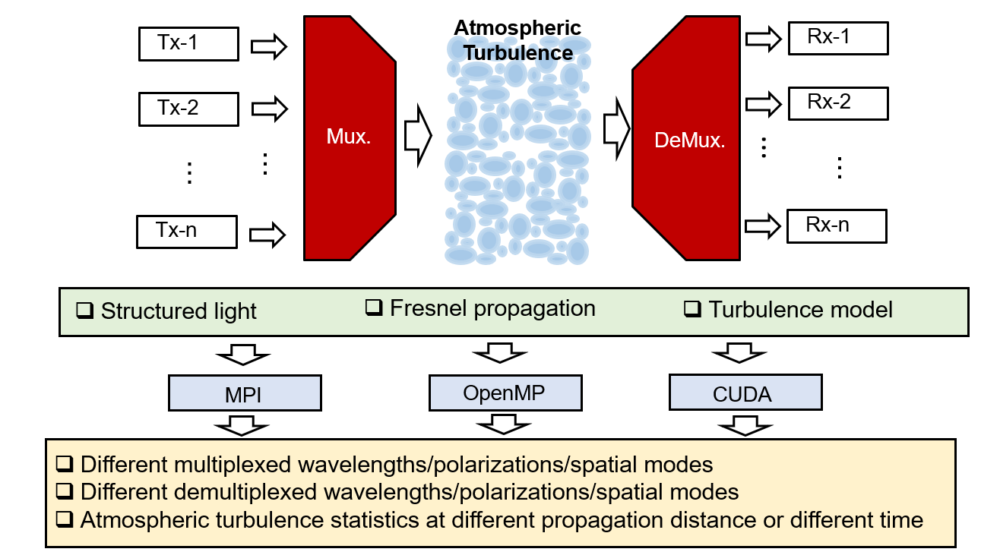

# Study of parallel computing techniques for simulating optical beam propagation in atmospheric turbulence
## Team members

Hao Song (songhao@usc.edu)

Kaiheng Zou (kaihengz@usc.edu )

HUibin Zhou (huibinzh@usc.edu)

Xinzhou Su (xinzhous@usc.edu )

## Goal (What's the "big" problem? Why important?)
There are growing interests in investigating and exploring free-space optical (FSO) communications. Compared with radio-frequency (RF) communications, FSO communications have a larger bandwidth and a lower probability of interception. To further increase the communication capacity and spectrum efficiency of FSO communications, multiple independent data channels could be multiplexed and transmitted simultaneously in different orthogonal domains. Two examples are frequency-division multiplexing (FDM, different channels on different frequencies) and polarization-division multiplexing (PDM, different channels on different polarizations).  Additionally and alternatively, there is a different approach that can complement as well as be compatible with FDM and PDM, and that is space-division-multiplexing (SDM). Specifically, a subset of SDM is mode-division-multiplexing (MDM), in which each data channel is carried by a different beam having a different orthogonal spatial mode.

A challenge of FSO communications using MDM is the atmospheric turbulence. Atmospheric turbulence can cause a phase differential at different cross-sectional locations of a propagating beam. Such phase distortion would break the spatial wave-front structure of different beams and induce power coupling from the intended mode into other modes. Given this phase change distribution in a changing environment, power coupling could be dynamic (e.g., perhaps on the order of milliseconds). The coupled power from other modes causes the channels crosstalk and degrades the MDM link performance if multiple modes carrying different independent data signals are tranmitted. 

To investigate the dynamic and random turbulence effects on the transmitted multiple beams and the system-degradation of the MDM FSO link, it might be desirable to develop a computational-efficient simulation system for beam propagation and its interaction with atmospheric turbulence. Several issues should be considered: 1) how to simulate the free-space optical beam propagation for a long distance, 2) how to simulate the atmospheric turbulence, and 3) how to efficiently simulate the turbulence effects on the propagated beam considering multiple different parameters, e.g. wavelength, model number, and turbulence statistics.  Due to the dynamic and random property of the turbulence effects, a large number of simulation processes might be required. Different parallel programming techniques (e.g. CUDA and openMP) might be able to help to accelerate the simulations. 

In this project, we will show how to apply parallel programming techniques in the simulation of optical beam propagation through atmospheric turbulence. In the following contents, several potential techniques are described: 1) simulation model for turbulence using multiple random phase plates, 2) using OpenMP to simulate the turbulence effects on optical beams with different parameters, and 3) using GPU accelerated CUDA to simulate the fast Fourier transform (FFT) algorithm for the free-space beam propagation.

## Scientific objectives

### Step 1:

Apply OpenMP techniques in simulating the multiple realizations of the turbulence effect on the optical beam with different wavelengths and orthogonal spatial modes.

### Step 2: 

Use CUDA techniques in simulating the Fourier transform-based beam propagation process.

### Step 3: 

Evaluate the efficiency of the simulation when tuning different parameters.

### Step 4: 

Adjust the code to maximize the efficiency under different conditions.

## Previous work

## Potential techniques to use

Simulation model and parallel programing techniques used in simulating turbulence effects on optical beams.

To study the influence of atmospheric turbulence on optical beams, we first build a model to emulate the turbulence. According to Kolmogorov turbulence theory, the refractive index fluctuation caused by atmospheric turbulence can be described by a structure function Dn, which is determined by

Dn(Δr)=6.88(Δr/r0)5/3

where Δr is the distance between two points in space, and r0 is the Fried parameter, or the coherence length. Assuming the value of Cn2 keeps unchanged over propagation path, r0 can be calculated from the atmospheric structure constant Cn2 by the formula

r0=(0.423k2Cn2L)-3/5

where k=2/f is the wave number and L is the propagation length.

Based on the above equations, the turbulence can be simulated by using phase plates, which can be described as N-by-N matrices of random phase numbers with statistics that match Kolmogorov turbulence theory. The simulation model is shown in the figure. The input optical signal with single wavelength and single spatial mode is applied by the phase changes on each pixel defined by the phase plates. The phase plates are generated according to the abovementioned Kolmogorov theory to emulate the atmospheric turbulence. After certain amount of phase plates, an output beam is generated as the beam with the turbulence effect. The beam propagation is modeled with the Fourier transform-based method by

Eout=F-1{F{Ein}·H(λ,z)}

where Ein and Eout are the electrical fields of the beam before and after propagation. F-1 and F denote the inverse Fourier and Fourier transforms. H(λ,z) is the spectral transfer function of the propagation as a function of the wavelength λ and the propagation distance z.

In such a simulation model, there are several places that different parallel programming techniques can be used to accelerate the simulation, as shown in the figure. In a typical free-space optical communication system, multiple wavelengths and multiple spatial modes are used to increase the data capacity. These wavelengths and spatial modes are orthogonal, meaning that they have little influence over each other. Therefore, we can use OpenMP to simulate the turbulence effect on these optical beams with different wavelengths and spatial modes. To show a better modelling of a dynamic turbulence effect, we need to simulate multiple realizations of the emulating phase plates. We can also use OpenMP to simulate the different realizations. The Fourier transform in the propagation process is implemented by the fast Fourier transform (FFT) algorithm, which is also shown in the model figure. We can use the cuFFT of the GPU accelerated CUDA for the FFT simulation.

## Expected results

### Preliminary results

As a start, we simulate a Gaussian beam propagating through a single phase plate. We change the turbulence realizations and process the statistics of the received Gaussian power at the reciever (i.e., count the number of the cases when the received ratio power is in the certain range).

Below are some parameters of the model.

Parameters | Values |
--- | --- |
Beam waist | 5 mm |
Wavelength  | 1550 nm |
Propagating distance  | 10 m |
Fried parameter of turbulence  | 1.0 mm |
Number of turbulence realization | 10000 |
Number of threads | 32 |

Futhermore, we also evaulate the scaling performance.

### What's our next step?

In the future, we would:

1. investigate other parallel computing techniques including CUDA to speed up the out simulation.

2. investigate the feasibility of different techniques for different sub-problems. For instance, we could use CUDA to speed up the FFT computation.

3. study the scalability of the proposed techniques for different scenerios. For example, we could use hybrid openMP and CUDA techniques for simulating the turbulence effect on different spatial modes.
