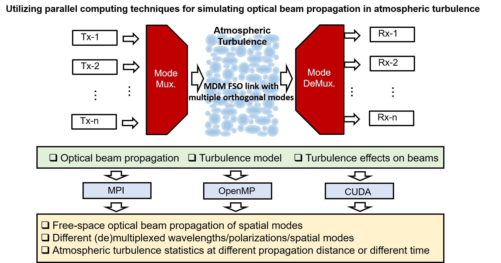
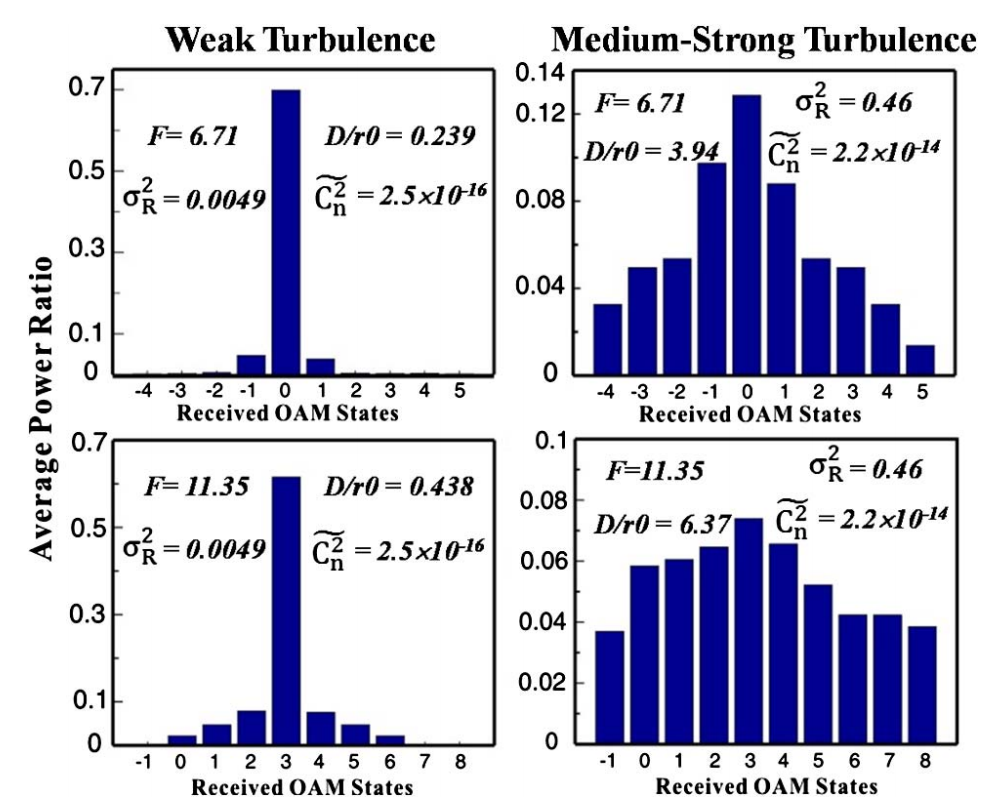
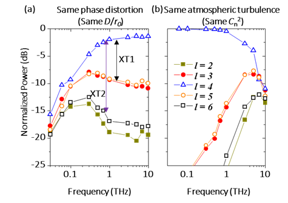
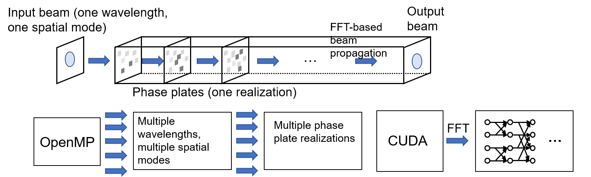
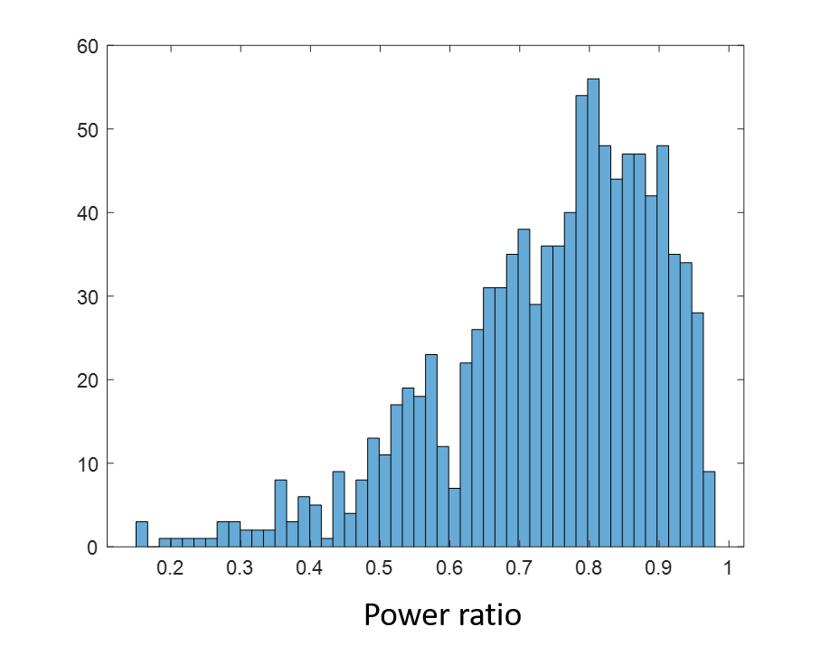
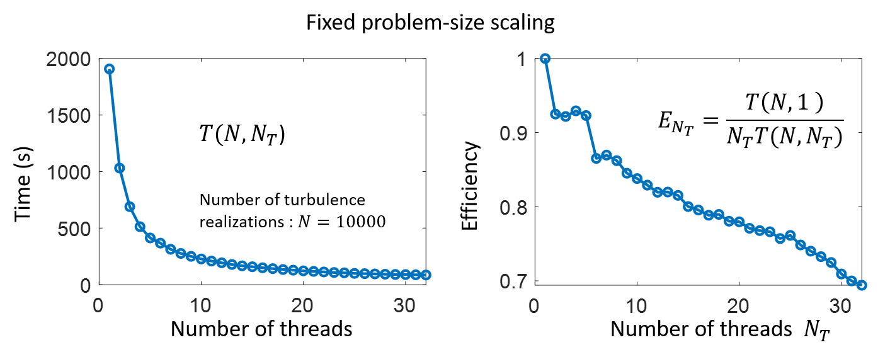
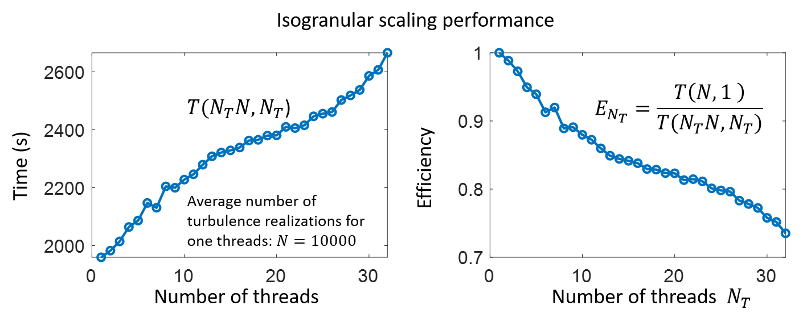

# Study of parallel computing techniques for simulating optical beam propagation in atmospheric turbulence
## Team members

Hao Song (songhao@usc.edu)

Kaiheng Zou (kaihengz@usc.edu )

HUibin Zhou (huibinzh@usc.edu)

Xinzhou Su (xinzhous@usc.edu )

## Goal (What's the "big" problem? Why important?)
There are growing interests in investigating and exploring free-space optical (FSO) communications. Compared with radio-frequency (RF) communications, FSO communications have a larger bandwidth and a lower probability of interception. To further increase the communication capacity and spectrum efficiency of FSO communications, multiple independent data channels could be multiplexed and transmitted simultaneously in different orthogonal domains. Two examples are frequency-division multiplexing (FDM, different channels on different frequencies) and polarization-division multiplexing (PDM, different channels on different polarizations).  Additionally and alternatively, there is a different approach that can complement as well as be compatible with FDM and PDM, and that is space-division-multiplexing (SDM). Specifically, a subset of SDM is mode-division-multiplexing (MDM), in which each data channel is carried by a different beam having a different orthogonal spatial mode.

A challenge of FSO communications using MDM is the atmospheric turbulence. Atmospheric turbulence can cause a phase differential at different cross-sectional locations of a propagating beam. Such phase distortion would break the spatial wave-front structure of different beams and induce power coupling from the intended mode into other modes. Given this phase change distribution in a changing environment, power coupling could be dynamic (e.g., perhaps on the order of milliseconds). The coupled power from other modes causes the channels crosstalk and degrades the MDM link performance if multiple modes carrying different independent data signals are tranmitted. 

To investigate the dynamic and random turbulence effects on the transmitted multiple beams and the system-degradation of the MDM FSO link, it might be desirable to develop a computational-efficient simulation system for beam propagation and its interaction with atmospheric turbulence. Several issues should be considered: 1) how to simulate the free-space optical beam propagation for a long distance, 2) how to simulate the atmospheric turbulence, and 3) how to efficiently simulate the turbulence effects on the propagated beam considering multiple different parameters, e.g. wavelength, model number, and turbulence statistics.  Due to the dynamic and random property of the turbulence effects, a large number of simulation processes might be required. Different parallel programming techniques (e.g. CUDA and openMP) might be able to help to accelerate the simulations. 

In this project, we will show how to apply parallel programming techniques in the simulation of optical beam propagation through atmospheric turbulence. In the following contents, several potential techniques are described: 1) simulation model for turbulence using multiple random phase plates, 2) using OpenMP to simulate the turbulence effects on optical beams with different parameters, and 3) using GPU accelerated CUDA to simulate the fast Fourier transform (FFT) algorithm for the free-space beam propagation.

## Scientific objectives

### Step 1:

Apply OpenMP techniques in simulating the multiple realizations of the turbulence effect on the optical beam with different wavelengths and orthogonal spatial modes.

### Step 2: 

Use CUDA techniques in simulating the Fourier transform-based beam propagation process.

### Step 3: 

Evaluate the efficiency of the simulation when tuning different parameters.

### Step 4: 

Adjust the code to maximize the efficiency under different conditions.

## Previous work

Optical turbulence in the atmosphere is a result of variation of local temperature, pressure, or humidity in the atmosphere. The widely accepted Kolmogorov model for these fluctuations relates these temperature fluctuations to refractive index fluctuations. After propagation through the turbulent atmosphere, the wavefront of the transmitted laser beams will be distorted. Atmospheric structure constant Cn2 is used to evaluate the tuebulence strength. Another parameter r0, which is the Fried parameter, is also commonly designated as the coherence length of atmospheric turbulence. The r0 value can be driven from atmospheric structure constant Cn2.

Multiplexing of many independent data-carrying beams in the form of space-division-multiplexing (SDM) is important for enabling an increase in system capacity for point-to-point optical wireless communication links. One type of orthogonal modal basis set is orbital-angular-momentum (OAM). A beam that carries OAM has: (a) a phasefront that “twists” in the azimuthal direction as it propagates, (b) an OAM l value that is the number of 2π phase shifts in the azimuthal direction, and (c) an intensity profile that is a ring-shaped vortex. Different OAM beams could be efficiently multiplexed and demultiplexed with inherently low crosstalk. However, atmospheric turbulence would destort the phase distribution of the beams, and induce modal coupling to other OAM modes and increase the channel crosstalk. Such crosstalk would influence the orthogonality of different communication channels and influence the channel performence.

Average power ratio on neighboring OAM channels when transmitting modes l=0 (upper) and l=3 (lower) under different emulated turbulence conditions.

Above figure shows previous experimental results about modal spectrum of OAM beams through the turbulence with different strength. The normalized average powers for l=0 (upper) and l=3 (lower) under different emulated turbulence conditions are plotted. A single phase plate follows Kolmogorov distribution is used emulate an equivalent 1 km long real atmospheric link. We can see that the majority of the power is still in the transmitted OAM mode under weak turbulence but it spreads to neighboring modes as the turbulence strength increases. Same measurement statistics of the turbulence are also used to evaluate the influence of mode order dependence. As the divergence of OAM mode is directly related to l, the size of the beam incident on the phase screen plate is larger for OAM l 3, indicating that it will experience stronger turbulence distortions.

There has also been an emerging area of utilizing OAM multiplexing for THz-wave communication links. In the THz region, both divergence effect, which wil enlarge the beam size after the propagation, and the turbulence effect, which destroy the beam profile, need to be considered. The divergence effect increases with the increase of the frequency while the turbulence effect decreases with with the increase of the frequency. Since both divergence and turbulence-induced phase distortion are frequency-dependent, to understand the influence of both effects on the crosstalk (XT) of THz OAM links, previous simulation work separate these two effects by simulating the propagation (i) with the same D/r0 and (ii) same Cn2. The Fried parameter r0 and atmospheric structure constant Cn2 are parameters representing the strength of the turbulence effects and they could be mutually converted. The value of D/r0 determines the strength of the phasefront distortion. With the same value of D/r0, the influence of r0 is minimized, which is frequency-dependent, on the strength of the phasefront distortion, thus the simulation results could focus on the influence of divergence on the XT of the THz OAM links under the turbulence condition. Subsequentially, the XT at different frequencies with the same Cn2 is also simulated, considering both different divergence and phase distortion effects for different frequencies.

Simulation results: normalized power on different OAM modes when varying the frequency. OAM +4 is transmitted for all the ceases. (a) Mainly considering the divergence effect, phase distortion is similar for the OAM beams at different frequencies: 200-m link with the same D/r0 = 0.224 and w0 = 0.1 m at the transmitter side. (b) Considering both divergence and turbulence effects: a 200-m link with the same Cn2 = 1 × 10-11 m-2/3 and w0 = 0.1 m at the transmitter side. The legends and scales in the y-axis in (a) and (b) are the same. XT1: crosstalk to the neighboring mode; XT2: crosstalk to the 2nd-neighboring mode.

The above figure (a) shows the influence of divergence on the XT performance of the THz OAM links under turbulence over ~ 0.1-10 THz with the same D/r0. The power leakage to the right-(higher)-nearest and 2nd-nearest mode is defined as XT1 and XT2, respectively, where the power leakage is normalized by the received power on the transmitted mode. As shown in Fig. (a), for a THz link for which the input beam has the same value of D/r0 at the first simulated phase plate, the signal power on the transmitted OAM mode +4 increases, and the XT to neighboring modes decreases when the frequency increases. Specifically, when the frequency increases from 0.03 THz to 10 THz for a 200-m link, the signal power increases by ~ 8 dB, and XT1 decreases by ~ 5 dB when the OAM beam has the same value of D/r0 = 0.224 at the transmitter side. This might be due to the following: (i) lower-frequency OAM beams diverge faster during free-space propagation, and thus they have larger beam sizes at the same propagation distance; and (ii) the phasefront becomes increasingly distorted when the beam size of the transmitted OAM beam increases, which is due to the increase of  D/r0  during the beam propagation.

The simualtion further study the dependence of XT performance on frequencies over ~ 0.1-10 THz with the same atmospheric structure constant Cn2 in terms of both frequency-dependent divergence and turbulence effects. In this case, both the beam size and Fried parameter changes with the frequency. In contrast to the case with the same value of D/r0 as shown in Fig. (a), the simulation results show that for a THz link where the atmosphere has the same value of Cn2, the higher the frequency, the stronger the distortion effect. As shown in Fig. (b), the signal power decreases by ~ 11 dB, and XT1 increases by ~ 38 dB, where the OAM beam propagates through the turbulence with the same value of Cn2 = 1 × 10-11 m-2/3. This could be because although a higher frequency leads to a smaller divergence, the value of D/r0 still increases with the frequency, resulting in a larger phasefront distortion.

## Potential techniques to use

Simulation model and parallel programing techniques used in simulating turbulence effects on optical beams.

To study the influence of atmospheric turbulence on optical beams, we first build a model to emulate the turbulence. According to Kolmogorov turbulence theory, the refractive index fluctuation caused by atmospheric turbulence can be described by a structure function Dn, which is determined by

where Δr is the distance between two points in space, and r0 is the Fried parameter, or the coherence length. Assuming the value of Cn2 keeps unchanged over propagation path, r0 can be calculated from the atmospheric structure constant Cn2 by the formula

where k=2/f is the wave number and L is the propagation length.

Based on the above equations, the turbulence can be simulated by using phase plates, which can be described as N-by-N matrices of random phase numbers with statistics that match Kolmogorov turbulence theory. The simulation model is shown in the figure. The input optical signal with single wavelength and single spatial mode is applied by the phase changes on each pixel defined by the phase plates. The phase plates are generated according to the abovementioned Kolmogorov theory to emulate the atmospheric turbulence. After certain amount of phase plates, an output beam is generated as the beam with the turbulence effect. The beam propagation is modeled with the Fourier transform-based method by

where Ein and Eout are the electrical fields of the beam before and after propagation. F-1 and F denote the inverse Fourier and Fourier transforms. H(λ,z) is the spectral transfer function of the propagation as a function of the wavelength λ and the propagation distance z.

In such a simulation model, there are several places that different parallel programming techniques can be used to accelerate the simulation, as shown in the figure. In a typical free-space optical communication system, multiple wavelengths and multiple spatial modes are used to increase the data capacity. These wavelengths and spatial modes are orthogonal, meaning that they have little influence over each other. Therefore, we can use OpenMP to simulate the turbulence effect on these optical beams with different wavelengths and spatial modes. To show a better modelling of a dynamic turbulence effect, we need to simulate multiple realizations of the emulating phase plates. We can also use OpenMP to simulate the different realizations. The Fourier transform in the propagation process is implemented by the fast Fourier transform (FFT) algorithm, which is also shown in the model figure. We can use the cuFFT of the GPU accelerated CUDA for the FFT simulation.

## Expected results

### Preliminary results

As a start, we simulate a Gaussian beam propagating through a single phase plate. We change the turbulence realizations and process the statistics of the received Gaussian power at the reciever (i.e., count the number of the cases when the received ratio power is in the certain range).

Below are some parameters of the model.

Parameters | Values |
--- | --- |
Beam waist | 5 mm |
Wavelength  | 1550 nm |
Propagating distance  | 10 m |
Fried parameter of turbulence  | 1.0 mm |
Number of turbulence realization | 10000 |
Number of threads | 32 |

Futhermore, we also evaulate the scaling performance.

### What's our next step?

In the future, we would:

1. investigate other parallel computing techniques including CUDA to speed up the out simulation.

2. investigate the feasibility of different techniques for different sub-problems. For instance, we could use CUDA to speed up the FFT computation.

3. study the scalability of the proposed techniques for different scenerios. For example, we could use hybrid openMP and CUDA techniques for simulating the turbulence effect on different spatial modes.
